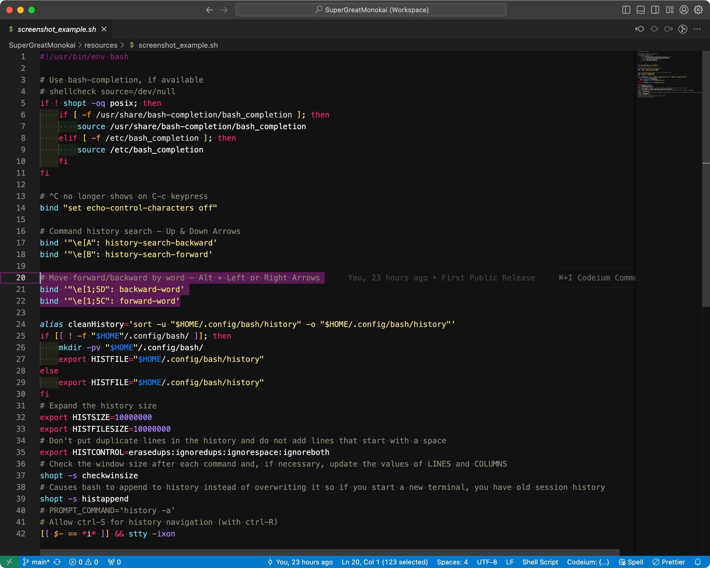

# SuperGreatMonokai

This is a theme meant for VS Code users who love monokai Syntax Highlighting Colors but not the editor colors!

Editor colors are based on VSCode's Dark + theme.

Adds fish Shell Syntax Highlighting Colors.

Adds VimL Syntax Highlighting Colors.

## Adds my terminal theme colors:


## Settings

To get the full experience goto your settings.json by doing `Cmd+Shift+P` or `Ctrl+Shift+P` and finding `Preferences: Open Settings (JSON)`.

```json
"editor.semanticTokenColorCustomizations": {
    "enabled": true // enable for all themes
},
"editor.renderLineHighlight": "gutter",
```

## Screenshot (SuperGreatMonokai):



## Credits

This theme incorporates the VSCode Monokai theme [@vscode_MonokaiTheme](https://github.com/microsoft/vscode/tree/main/extensions/theme-monokai)

This theme incorporates the VSCode Dark + Editor theme [@vscode_Dark+Theme](https://github.com/microsoft/vscode/)

This theme bundles in Fish Shell Syntax Highlighter from [@bmalehorn](https://github.com/bmalehorn/vscode-fish)

This theme bundles in VimL Syntax Highlighter from [@dunstontc](https://github.com/dunstontc/viml)

This theme was created by [@def-SpaceWar](https://github.com/def-SpaceWar/sublime-monokai)
